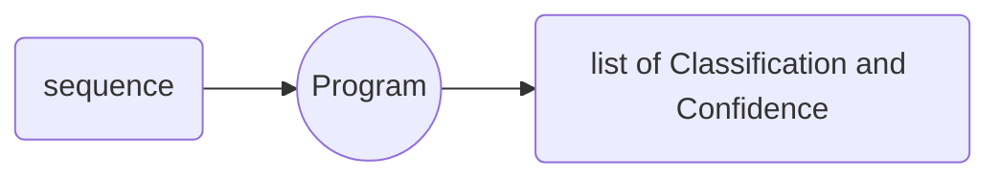
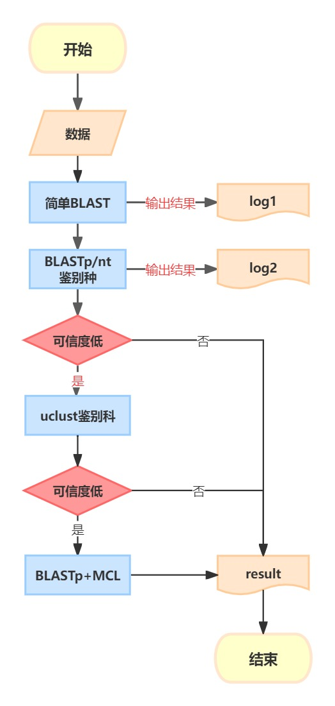

# First Meeting Reviews

## Requirement

## methods

1. Initial classification Using BLAST(使用blast做一个初步判断)
2. all-to-all Clustering(all to all 聚类)
3. Constructing a Phylogenetic Tree(系统发育树)

## classification steps

